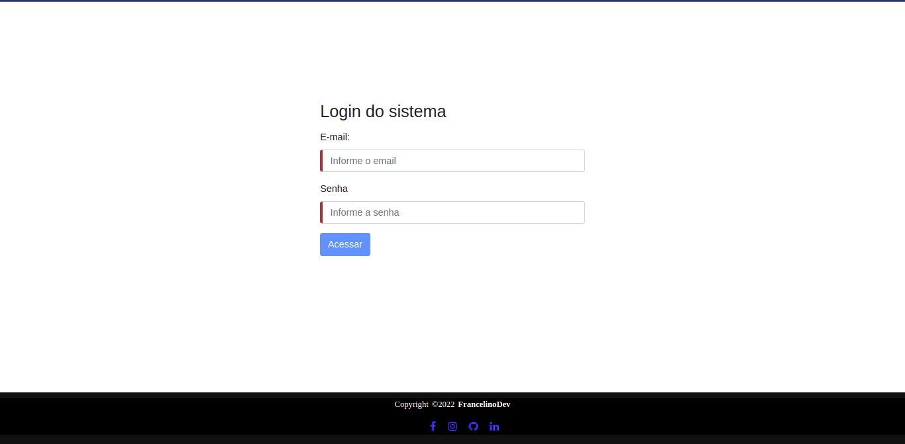

# AngularREST.

---

## Indice

- [AngularREST](#angularrest)
  - [Indice](#indice)
  - [Sobre](#sobre)
  - [Funcionalidade da Aplicação](#funcionalidade-da-aplicação)
  - [Tecnologias utilizadas](#tecnologias-utilizadas)
  - [Como baixar o projeto](#como-baixar-o-projeto)
  - [Autor](#autor)
  
---

## Sobre 

O Projeto **AngularREST** foi desenvolvido para criação de usuários com validações de campos e com paginação da lista de usuários, tem pesquisa por nome de usuários. A parte do backend foi desenvolvido em conjunto com a aplicação de front para que todos os dados salvo no front seja levado para o backend.

<span style="color: red">
OBS: Projeto ainda está em desenvolvimento para finalizar as outras funcionalidades.
</span>

---

## Funcionalidade da Aplicação

A aplicação exemplo consiste em criar:
- Usuários com um formulário com validações de campos;
- Lista com os usuários criados;
- Atualizar informações do usuário
- Remover usuário
- Tela de login com validações de campos

Telas examplos: 

<h1>
  
  
  
  
</h1>

---
## Tecnologias utilizadas 

O projeto foi desenvolvido utilizando as seguintes tecnologias
- [Angular 12](https://angular.io/)
- [Bootstrap 4](https://getbootstrap.com/docs/4.1/)
- JavaScript
- TypeScript
- HTML
- CSS

---

## Como baixar o projeto

```bash
# Clonar o repositório em sua máquina 
$ git clone https://github.com/francelinom/AngularREST.git

# Entrar na pasta do projeto 
$ cd AngularREST

# Instalar todas as dependências 
$ npm i

# Iniciar o projeto 
$ ng serve
```
---
## Autor

Desenvolvido por **Francelino Marcílio da Silva** 
<h1>
  
</h1>
